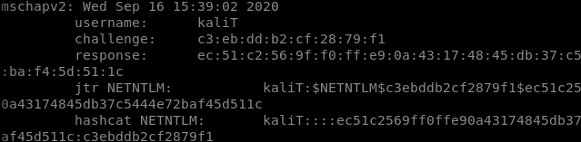
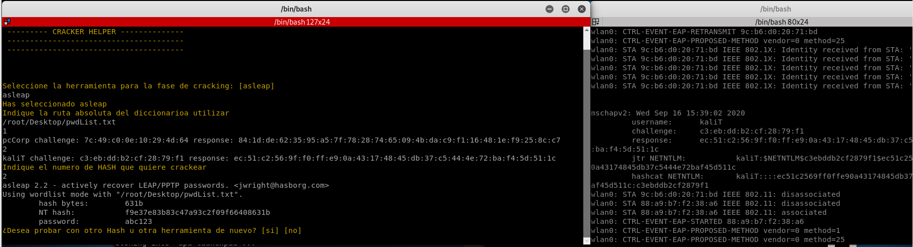

# razorAP

razorAP es una herramienta de Bash y Python empleada para generar puntos de acceso falsos de redes Wifi con autenticación 802.1X .

Las piezas básicas para la autenticación 802.1X son:
. Solicitante : cliente de software que se ejecuta en la estación de trabajo WiFi.
. Autenticador : punto de acceso WiFi
. Servidor de autenticación : Una base de datos de autenticación, normalmente un servidor RADIUS

El protocolo de autenticación ampliable (EAP) es el utilizado para pasar la información de autenticación entre el solicitante (la estación de trabajo Wi-Fi) y el servidor de autenticación (RADIUS) y es el tipo de EAP el que en realidad controla y define la autenticación.

El objetivo es que un usuario víctima conecte su dispositivo al AP levantado por nuestra herramienta. Si esto sucede, y el usuario introduce su nombre de usuario y contraseña para autenticarse, razorAP recogerá tanto nombre de usuario como el hash (NTLM) de la contraseña.

Ejemplo:



## Instalación

Clonar el repositorio de github.

```bash
git clone https://github.com/migguel0/razorAP
```

Conceder permisos de ejecución al script de instalación.

```bash
chmod +x install.sh
```
Ejecutar el script de instalación.

```bash
./install.sh
```


## Uso

Para lanzarla herramienta ejecutar el script de inilización, el cual abrirá dos nuevas terminales
```bash
./init.sh
```
Por un lado se abrirá la terminal de configuración del punto de acceso y por otro lado la terminal de cracking.

#### Configuración del punto de acceso
La terminal de configuración nos ayudará en el proceso de configuración con los siguientes pasos:
1. Seleccionar interfaz a emplear.
2. Nombre del punto de acceso.
3. Nombre del certificado (será generado automáticamente por la herramienta)
4. CommonName a emplear.
5. Seleccionar banda sobre la que se desplegará (2.4GHz ó 5GHz)
6. Seleccionar canal

Una vez se hayan completados los pasos, se generarán automáticamente los certificados a incluir en el punto de acceso y se levantará automáticamente.

Ya levantado el punto de acceso, solo queda esperar a que algún usuario se conecte. una vez se conecte se mostrará por la terminal un mensaje similar al siguiente:


Es en este momento cuando podemos hacer uso de la terminal de cracking, o en su defecto, si esta ha sido cerrada, ejecutar el script 'cracker.sh'.

#### Cracking (TO-DO)
La herramienta implementada por ahora para tratar de crackear la contraseña es asleap.

Los pasos a seguir sobre el script de cracking son los siguientes:
1. Indicar la herramienta a emplear.
2. Indicar ruta absoluta del diccionario con el que se hará fuerza bruta.
3. Indicar, entre los Hashes enumerados por pantalla, el número que identifica el Hash a crackear.




## Notas

Las pruebas con la herramienta se han hecho en máquina virtual con Kali como SO.

Para las pruebas se ha usado la antena WiFi Alfa AWUS036AC.

Para la generación de los certificados se ha hecho uso del script en Python del siguiente repositorio de github: https://github.com/WJDigby/apd_launchpad.git
