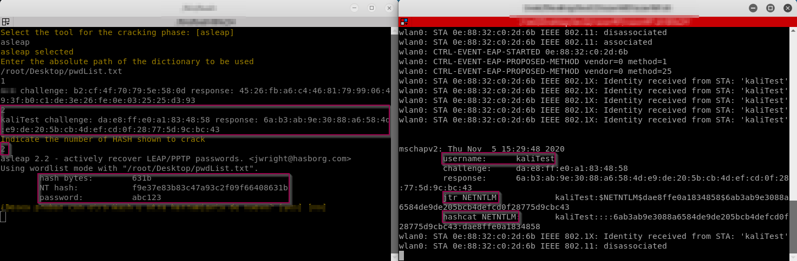

# razorAP

razorAP is a Bash and Python tool used to generate Fake Access Points for Wi-Fi networks with 802.1X authentication. 

The basic pieces for 802.1X authentication are
- Applicant: software client running on the Wi-Fi workstation.
- Authenticator: Wi-Fi access point
- Authentication server: An authentication database, usually a RADIUS server

The Extensible Authentication Protocol (EAP) is used to send authentication information between the supplicant (the Wi-Fi workstation) and the authentication server (RADIUS) and it is the type of EAP that actually controls and defines the authentication.

This tool is aimed to assist in the execution of some controls in Wi-Fi audits. Following the OWISAM methodology (https://www.owisam.org/index.php) the controls that razorAP would help with are the following: OWISAM-CT-001, OWISAM-CT-004, OWISAM-CT-007.

An example of what is expected when using razorAP is to achieve that users connect to the Access Point that we have deployed with the tool, and then enter their username and password to authenticate. Afterwards, since razorAP acts as an Authenticator, it will collect the authentication information (username and the hash NTLM of the password).


## Installation

Clone the github repository

```bash
git clone https://github.com/migguel0/razorAP
```

Grant execution permissions to the installation script.

```bash
chmod +x install.sh
```
Execute the installation script.

```bash
./install.sh
```


## Use

To launch the tool, run the initialization script, which will open two new terminals
```bash
./init.sh
```
On the one hand, the access point configuration terminal will be opened and on the other hand the cracking terminal.

#### Access point configuration
The configuration terminal will help us in the configuration process with the following steps:
1. Select the interface to be used.
2. Name of the access point.
3. Name of the certificate (it will be automatically generated by the tool)
4. CommonName to employ.
5. Select the band in which the AP will be displayed (2.4GHz or 5GHz)
6. Select channel

Once all the steps have been completed, the certificates to be included in the access point will be automatically generated and the access point will be automatically lifted.

Once the access point has been deployed, all that remains is to wait for a user to connect. Once connected, a message similar to the following one will be displayed on the terminal:


At this moment we can use the cracking terminal, or if it has been closed, execute the script 'cracker.sh'.

#### Cracking (TO-DO)
The tool implemented for now to try to crack the password is asleap.

The steps to follow about the cracking script are the following:
1. Indicate the tool to be used.
2. Indicate the absolute path of the dictionary with which you will use the brute force.
3. Indicate, among the Hashes listed on the screen, the number that identifies the Hash to be cracked.




## Notes

The tests with the tool have been made in a virtual machine with Kali as OS.

The Alpha WiFi antenna AWUS036AC was used for the tests.

For the generation of the certificates we have used the Python script from the following github repository: https://github.com/WJDigby/apd_launchpad.git
